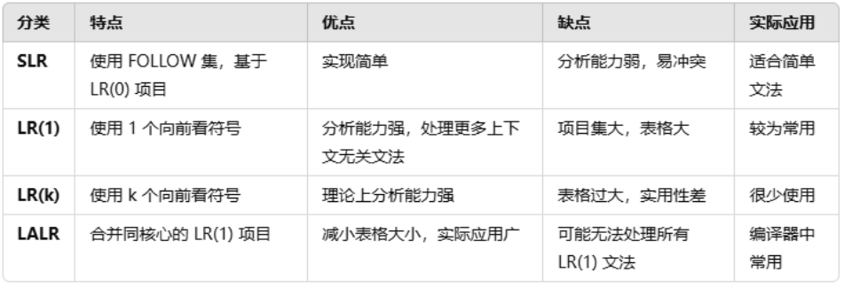

# 编译原理速通
速通这玩意真的有可能吗?

但我们是开卷考试, 我可以把它当小抄! 哈哈哈!

里面所有的"书"均指清华教材编译原理第3版(紫书)

里面所有的表格, 包括LL(1)驱动的预测分析表, 还有算符优先关系表等, 格子表达的二元关系的顺序是<纵轴值, 横轴值>
## 默认你懂符号串运算和离散数学

## 文法的定义
### G={Vn, Vt, P, S} (常表示为G[S])
- Vn是非终结符集合
- Vt是终结符集合
- 下面用V表示Vn⋃Vt
- P是规则集合
- S是开始符(不是集合), 属于Vn, 至少在一个P的规则中作为左部出现
### 相关定义
- **句型**是由G从S推导出来的符号串
- 所有符号都是终结符的句型是**句子**
- **语言**L(G)是所有G能推导出来的所有句子的集合

## 文法的分类 (语言从复杂到简单, 限制从少到多)
### 0型文法
- 对应图灵机
- 只要符合文法的基本定义就是0型文法, 即P中每一个规则 α -> β中, α至少包括一个非终结符

### 1型文法 (上下文有关文法)
- 是0型文法
- 对应于线性有界自动机(受到一点点限制的图灵机)
- 定义: P中每一个规则 α -> β 有 |α| <= |β| (特例:|α|=1, β=ε 算符合)
- 每一个产生式都不会使长度变短

### 2型文法 (上下文无关文法)
- 是1型文法
- 对应于下推自动机(DFA加一个无限大的栈)
- 定义: P中每一个规则都为 A -> β, A是非终结符, β∈V*

### LR(k)文法
- **适用于LR分析**
- 2型文法经过更强的限制得到:
- 考试中k=0或1

### 简单优先文法
- 是2型文法
- 任何语法符号组成的序偶存在最多一种优先关系(=,<,>)
- **适用于简单优先分析法**

### 算符文法 (OG文法)
- 是2型文法
- 任何规则中不包含两个非终结符相邻的情况
- 性质:
    - 可以推出任何句型中也都不包含两个相邻的非终结符
    - 在一个句型中, 终结符若和一个非终结符相邻, 他们在句型的所有短语里一定总是一起出现
- 符号该文法的任意句型如下:

    #N<sub>1</sub>a<sub>1</sub>N<sub>2</sub>a<sub>2</sub>...N<sub>n</sub>a<sub>n</sub>N<sub>n+1</sub>#

    其中N<sub>i</sub>要么是空, 要么是非终结符, a<sub>i</sub>是终结符

### 算符优先文法 (OPG文法)
- 是算符文法, 两个非终结符不会相邻
- 任何终结符组成的序偶存在最多一种优先关系(=,<,>)
- **适用于算符优先分析法**

### LL(k)文法
- 是2型文法
- 考试中只有k=1
- k=1时,**适用于确定的自顶向下分析**
- 2型文法经过更强的限制得到: 它的 SELECT 集合满足 SELECT(A->α) ⋂ SELECT(A->β) = ∅
- L:从左向右扫描句型; L:使用最左推导; k:只要向右看k个符号就可以决定使用哪个产生式推导

### 3型文法 (正则文法/正规文法)
- 是2型文法
- 对应于有限状态自动机, 即DFA, 也同样对应NFA
- 正则表达式用来表示此文法
- 分为左线性文法和右线性文法
- 定义: P中每一个规则都为 A ->a | aB (左线性文法) 或 A ->a | Ba (右线性文法), A和B都是非终结符, a∈Vt*

### 对分类的理解
- 从0 -> 1 (限制α长度小于β) -> 2 (限制α长度为1) -> 3 (限制β), 限制逐渐增强, 因此可以说1型文法是0型文法, 2型文法是1型文法等
- LR(k), LL(k), 简单优先文法, OG 和 OPG 都是2型文法, 为了适用于各自的分析方式构造的
- LR(k) 比 LL(k) 和算符优先文法限制少
- "上下文无关"比"上下文有关"约束更为强烈, 上下文有关推出的语言更复杂, 比如a b(c);是一个变量定义还是一个函数声明取决于符号c的含义, 即先前c的定义, 这个语句的解析上下文无关比更为复杂
- ### 没有一种语法分析适合所有2型文法, 所有分析方式都有其对应的适用范围
    - DFA/NFA - 3型文法
    - 确定的自顶向下语法分析(递归下降子程序/表驱动) - LL(1)文法
    - 简单优先分析法 - 简单优先文法
    - LR分析 - LR文法
    - 而大多数编程语言连2型文法都不是...所以编译原理这学科也就图一乐, 考过就行了
- 如果说一个语言不是上下文无关的, 它大概率是1型文法
- C/C++ 不是2型或3型文法
- Markdown 不是2型或3型文法, 其中*的含义取决于上下文
- pl0语言是2型LL(1)文法, 不是正则文法

## 2型文法的语法树
- 由于P中每一个规则都为 A -> β, A是单个非终结符, 故可以对一个句子构建语法树
- 语法树用来表示2型文法的推导过程
- 如果每次推导都从最右边开始, 称为**最右推导**(规范推导), 得到右句型(规范句型)
- 若可以构造多个最左/最右推导过程, 称此文法是**二义**的
- 若一个语言的所有文法都是二义的, 称此语言先天二义
- 构造语法树有两种方法, 自顶向下和自底向上
- 对于每一棵子树, 称:
    所有的叶子节点构成的符号串 是 该句型相对于根节点的**短语**, 若子树高度为2(直接推出), 则为相对于该直接推出规则的**直接短语**
- 右句型的直接短语称为**句柄**

    举一个例子:

    G[S]:
    - S -> T|S+T
    - T -> F|T*F
    - F -> (S)|i

    句型: i*i+i

    该句型的语法树: (用Typora看更香)
    ```mermaid
        graph TD;
        s2["S"]
        f2["F"]
        f3["F"]
        t2["T"]
        t3["T"]
        i2["i"]
        i3["i"]
        S-->s2;
        S-->+;
        S-->T;
        T-->F;
        F-->i;
        s2-->t2
        t2-->t3
        t2-->*
        t2-->f2
        t3-->f3
        f2-->i2
        f3-->i3
    

- 此时句型i*i+i的短语有:
    - i*i+i (相对于S)
    - i*i (相对于T) (相对于S)
    - i (相对于F) (相对于T) (直接短语, 相对于规则F->i)

## 词法分析
- 把字符流变成单词序列
- 需要借助语言的词法规则, 通常是正规文法
- 通过正规语法构造NFA, 然后转为DFA, 再进行DFA的化简 (书p47)

## 确定的自顶向下语法分析 (LL(1)文法)

- 从S开始, 不断地选择表达式拓展成目标的样子, 关键在**避免错误的选择**
- #### 我们需要构造SELECT集以进行正确的选择

    SELECT集由FIRST集和FOLLOW集构造, 结合二者信息共同判断是否选择该规则
    - FIRST(α) = {t| α=\*>tβ, t∈Vt, α, β∈V*}

        (相对于句型) 句型推出的所有结果中的开头终结符

        若 α∈Vt, 则FIRST(α) = {α} (显然如此)

    - FOLLOW(A) = {t| S=\*>...At..., t∈Vt, β∈V*, A∈Vn}

        (相对于非终结符) 非终结符后面紧跟着的所有终结符
    - SELECT(A->α) = (FIRST(α)-{ε} ⋃ FOLLOW(A))
    - **不管是FIRST, FOLLOW还是SELECT, 里面只有终结符号和\#和ε**
- #### LL(1)的分析法:
    - 递归下降子程序法 (如果依靠程序员的本能写parser大概率会得到这个东西)

        对语法的每一个非终结符都编一个分析程序, 它们之间相互调用形成递归
    - 表驱动 (书p93) 看后面

- #### 判断给定2型文法是不是LL(1)
    - 先求出能推出ε的非终结符, 如果某个非终结符A能推出ε, 等下给他的FIRST集加上ε (相当于单独考虑ε)
    - 其实**SELECT集不包含ε, 所以如果不用写出FIRST集, 你根本无需考虑ε**
    - 求所有文法文法符号的FIRST集: 这里有一些技巧减少重复计算
        - 记住先不考虑FIRST包含ε
        - 终结符的FIRST集只有它自己
        - 按定义求一些简单的FIRST集
        - 书本: 若X, Y<sub>1</sub>, Y<sub>2</sub>...Y<sub>n</sub>∈Vn,
        X -> Y<sub>1</sub>, Y<sub>2</sub>...Y<sub>n</sub>, 
        且Y<sub>1</sub>, Y<sub>2</sub>...Y<sub>i-1</sub> =\*> ε,
        则Y<sub>1</sub>, Y<sub>2</sub>...Y<sub>i</sub>的FIRST集合包含在FIRST(X)中 (所有FIRST集不含ε) (0<=i<=n)
        
            意思是, **若有X=\*>Y, 则FIRST(Y)⊆FIRST(X)** (所有FIRST集不含ε)
        - 最后给能推出ε的非终结符FIRST集加上ε
    - 求所有规则中右边符号串的FIRST
        - 若以非终结符号开头, 则其FIRST集就是该终结符
        - 其他的参照上面
    - 计算所有非终结符的FOLLOW集
        - FOLLOW集中没有ε
        - \#∈FOLLOW(S), S为开始符
        - **若有A -> ...Bβ, 则有FIRST(β)-{ε}⊆FOLLOW(B)**
        - **若有A =\*> ...B, 则有FOLLOW(A)⊆FOLLOW(B)**
    - 根据定义写出所有规则的SELECT集
    - 看看**包含同一个非终结符的规则的SELECT有没有交集**, 有则不是LL(1), 也就是LL(1)分析表的一个格子只能有一个规则
    

- #### 表驱动LL(1)分析程序
    - 见书p94
    - 先**判断给定2型文法是不是LL(1)**, 这之后你有了SELECT集
    - 构造LL(1)预测分析表: 
        - 横轴为终结符, 纵轴为非终结符
        - 对于每个格子[A, α], 若终结符α∈SELECT(A->α), 把A->α放到格子中
    - #### 表驱动程序怎么运行?
        - 句子括号用#表示, 即在句子后面加上#作为结尾, 在栈顶加入开始符S作为开头
        - 先看分析栈顶的非终结符A, 再看剩余符号串的最左部终结符α, 选取规则[A, α]
        - **运用该规则处理栈顶的非终结符. 即弹出它, 它根据规则产生的东西入栈**
        - 如果分析栈顶产生终结符β, 将其删去, 同时删去剩余符号串的最左部终结符, 它应该也是β, 此时称"**接受β**"
        - 栈顶的非终结符推出ε时, 弹出它即可
        - 栈的最后一个元素变为ε时, 程序结束
        - **我们可以看出, 分析栈经历的过程, 从S到目标符号串, 正是自顶向下**

- #### 对于大部分非LL(1)的2型文法, 可以将其转换为LL(1), 使其适用确定的自顶向下语法分析
    - 提取左公因子
    
        例子:
        G[S]:
        - S -> aSb
        - S -> aS

        先提取a:
        - S -> aS(b|ε)

        再把括号转换为非终结符:
        - S -> aSA
        - A -> b
        - A -> ε

    - 消除左递归 (变成右递归)
    
        什么是左递归?
        - 直接左递归: 
            - S -> Sa
            - S -> b
        - 间接左递归: 
            - A -> Ba
            - B -> Ab
            - B -> ε

        怎么消除左递归?
        
        - 直接左递归: 改写上例变成右递归: 
            - S -> bS'
            - S' -> aS'|ε

        - 间接左递归: 通过代入把间接左递归文法改写为直接左递归文法, 再消除

            此例中把第一个规则代入第二个规则, 得到:
            - B -> Bab
            - B -> ε

## 自底向上优先分析 (2型文法)

- 从目标句型开始, 不断地选择表达式进行归约, 最后只剩S, 关键也在**避免错误的选择**
- 按一定规则求出该文法所有符号的**优先关系**, 然后按该关系求出**句柄**
- 上面提过, 右句型的直接短语称为**句柄**
- #### 简单优先分析法 (简单优先文法)
    - 适用于简单优先文法
    - 简单优先关系是在V集合, 全体文法符号上的二元关系
    - 因为打不出某些符号, 这里直接用=,<,>
    - 接下来的所有X,Y都属于全体文法符号, 即V
    - 若有规则 A->...XY... 则称X和Y的优先性相等, 记作X=Y (注意是X在左, Y在右, 后面也是)
    - 若有规则 A->...XB... 且B=+>Y 则称X的优先性小于Y, 记作X<Y (Y的层数比X大, Y比X先归约) 
    - 若有规则 A->...BD... 且B=+>X D=\*Y 则称X的优先性大于Y, 记作X>Y (X的层数也许比Y大)
    - 这个关系不满足自反/对称/传递! 顺序很重要, X=Y不一定Y=X, X>Y不一定Y<X
    - 这个关系不满足三歧性(有可能没有关系), 但根据简单优先文法的定义, 确定顺序的两个元素间最多只有一个关系存在
    - 求出关系表, 表先纵轴后横轴
    - 怎么使用这个表格归约? (书p107)
- #### 算符优先分析法 (算符优先文法)
    - 需要使用算符优先文法(OPG), 见上
    - 算符优先文法只考虑终结符的优先关系
    - 优先关系实际上是某种**结合律**的体现
    - 算符优先关系可以简单地以以下例子直观说明:
        - 一个算符优先于自己, 意味着它服从左结合

            比如+>+ 意味着1+2+3 = (1+2)+3
        - 相反, 一个算符优先性低于自己, 意味着它服从右结合
        - 任何运算符优先性大于#, 除了它自己, 这意味着它右结合, 它又总是位于句子最右端, 因此被最后归约
        - 对于括号类的算符, 往往有A->(B)导致(=), 这代表他俩同时归约, 而)和(的关系往往没有定义, 其次, )往往优先于其他所有算符, 其他所有算符也优先于), 这代表右括号左结合; 相反的, )优先性往往低于其他所有算符, 其他所有算符优先性也低于(, 这代表左括号右结合
    - 如何计算任一终结符对的优先关系? (书p110)
        - 我们需要FIRSTVT集和LASTVT集
            - FIRSTVT(B) = {b|B=+>b... 或 B=+>Cb...}

                非终结符B能推出的所有句型中的第一个终结符

            - LASTVT(B) = {b|B=+>...b 或 B=+>...bC}

                非终结符B能推出的所有句型中的最后一个终结符
        - 对如下形式的规则
            - A->...ab...
            - A->...aBb...

            (他们两个之间不隔着其他终结符, 因为这种奇怪的结合律只能应用于相邻终结符)
            
            (**空白处表示这两个终结符不能相邻, 故没有优先关系**)

            有a=b成立
        - **对 A->...aB..., 有a<FIRSTVT(B)**
            
            即对每一个b∈FIRSTVT(B), 有a<b

            (同样, 他们两个之间不隔着其他终结符)

        - **对 A->...Ab..., 有FIRSTVT(A)>b**
        
            即对每一个a∈FIRSTVT(A), 有a>b

            (同样, 他们两个之间不隔着其他终结符, 记住这点就行了)
    - 我们如果有n个函数, 存放优先关系要占用O(n<sup>2</sup>)的空间, 能不能把它优化一下? (书p118)

        虽然优先关系不是偏序关系, 但我们可以构造两个用整数f,g表示的优先等级 (没给出证明, 不明白为什么可以构造捏), 使得:
        - a=b 有f(a)=g(b)
        - a<b 有f(a)<g(b)
        - a>b 有f(a)>g(b)

        总是成立.

        这样就只需O(n)的空间存储关系, f,g称为优先函数

        #### 怎么构造这样的函数?
        - 对每一终结符a∈Vt (包括#), 初始化f(a)=g(a)=1, 随后的操作只增不减
        - 若a>b 而f(a)<=g(b), 令f(a)=g(b)+1
        - 若a<b 而f(a)>=g(b), 令g(b)=f(a)+1
        - 若a=b 而f(a)≠g(b), 令min{f(a),g(b)} = max{f(a),g(b)} (只增不减)
        
        优先函数的直观含义
        - **f意味着左结合性**(我自造的词)**, g意味着右结合性**
        - f(#)和g(#)总是最低, 这意味着它最后结合
        - 对于括号类, f(()和g())总是最低, g(()和f())总是最高, 因为左括号右结合, 右括号左结合
        - 对于变量类(i), f(i)和g(i)总是最高, 它总是和其他算符先结合

        它有一个问题: 有的关系没有定义, 但这优先函数全能比较出来

## LR分析 (LR文法)
- 一种自底向上分析
- 使用规范归约 (最左归约, 规范推导的逆过程)

### LR(0)
- 使用两个栈(文法符号栈和状态栈), 一个分析表
- 我们需要根据不同文法构造ACTION-GOTO表
- 一个ACTION-GOTO表: (书p125) (书p136)

    ACTION表中的第[S<sub>i</sub>, a] (S<sub>i</sub>是状态, a是输入串顶部终结符) 个格子可能有 :
    - S<sub>i</sub> : 往状态栈压入状态i
    - r<sub>j</sub> : 用第j个规则, 比如A->β, 归约符号栈最顶部, 同时状态栈弹出|β|个状态
    - 空的, 代表遇到错误

    GOTO表中的第[S<sub>i</sub>, A] (S<sub>i</sub>是状态, A是符号栈顶部非终结符) 个格子可能有某个状态, 到了这个格子就往状态栈压入状态i

    先执行ACTION, 后执行GOTO
- #### 怎么构造ACTION-GOTO表?
    - **GOTO**
        - GOTO表一般只用非终结符
        - 要构造GOTO表, 我们需要识别活前缀的DFA, DFA的状态转换矩阵就是GOTO表
        - 活前缀是输入串(规范句型)已分析过的、没有语法错误的前缀部分

            例:
            对于句型αβt, β表示句柄, 如果αβ= u1u2...ur, 那么符号串u1u2...ui (1≤i≤r) 即是句型αβt的活前缀
        - 这个DFA大概长这样:
            ```mermaid
                graph LR;
                S1-->|X<sub>1</sub>|S2
                S2-->|X<sub>2</sub>|S3
                S2-->|X<sub>3</sub>|S4
                S4-->|X<sub>4</sub>|S5
                S3-->|X<sub>5</sub>|S1

            
        - 其中S<sub>i</sub>是状态, X<sub>i</sub>是非终结符.
        - 为什么识别活前缀不考虑终结符呢? 
            - 因为要和ACTION分开, 避免在状态转移逻辑中的冲突

        - **构造方法**
            - 首先求出每个表达式的**项目**

                举例:

                表达式: S->aAcBe

                项目:
                - S->●aAcBe
                - S->a●AcBe
                - S->aA●cBe
                - S->aAc●Be
                - S->aAcB●e
                - S->aAcBe●

                项目是分析过程中的某一时刻已经归约的部分和等待归约部分,
                其中●前已经被归约,●后等待归约
            - 朴素的方法:根据项目写出NFA,然后确定化为DFA
                - 规定项目S->●aAcBe为NFA的唯一初态
                - 任何项目均认为是NFA的终态(活前缀识别态)
                - 
            - 更快的方法:
    - **ACTION**
        - ACTION表一般只用终结符
        - 一共有移进和归约, 接受和出错四种动作
        - 当遇到ACTION[S<sub>i</sub>,a]时:
            - 移进 (ACTION[S<sub>i</sub>,a] = S<sub>j</sub>):

                将a推进栈并设置新的栈顶状态S<sub>j</sub>
            - 归约 (ACTION[S<sub>i</sub>,a] = r<sub>c</sub>):

                使用第c个文法规则 (假设是 A→β) 归约符号栈最顶部的β (弹出β, 把A推进栈, 同时弹出和β相同长度的状态),
                并设置新的栈顶状态Sj = GOTO[S<sub>i-|β|</sub>,A]
            - 接受 (ACTION[S<sub>i</sub>,a] = accept)
            - 出错 (ACTION[S<sub>i</sub>,a] 为空白)
        
        
### SLR(1)
### LR(1)

## 语法制导 (2型文法)